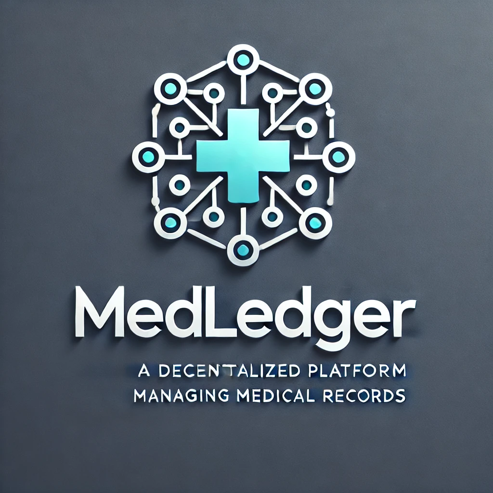

# MedLedger - Decentralized Medical Record Management



## About

MedLedger (initially called medrecordchain[from video-demo]) is a decentralized platform built to securely manage patient medical records and appointments using blockchain technology. By leveraging blockchain’s transparency, patients retain full control over their sensitive health data, granting permission-based access to healthcare professionals. MedLedger ensures data integrity, privacy, and seamless interactions between patients and doctors.

## Table of Contents
[About](#about)
- [Problem Statement](#problem-statement)
- [Features](#-features)
- [Technology Stack](#-technology-stack)
- [Getting Started](#-getting-started)
  - [Prerequisites](#prerequisites)
  - [Installation](#installation)
- [Usage](#-usage)
  - [For Patients](#for-patients)
  - [For Doctors](#for-doctors)
- [Smart Contracts Overview](#-smart-contracts-overview)
- [Contributing](#contributing)
- [License](#license)
- [Acknowledgments](#acknowledgments)
- [Future Work](#future-work)

## Problem Statement

<div>
The healthcare industry is increasingly digitizing medical records to improve accessibility and efficiency. However, many existing systems suffer from a lack of patient control over their data, vulnerability to data breaches, and fragmented communication between patients and healthcare providers. Traditional medical record systems store sensitive health data in centralized databases, making them susceptible to unauthorized access, data manipulation, and privacy violations. Additionally, the process of granting or revoking access to medical records is often cumbersome, leading to inefficient workflows and a lack of trust between patients and healthcare professionals.

Moreover, the management of appointments, record access, and patient-doctor interactions remains opaque, with little transparency on who has accessed patient data or when. These challenges undermine the potential of healthcare systems to ensure privacy, security, and seamless care.

MedLedger aims to address these issues by providing a decentralized solution that puts patients in control of their medical records. By leveraging blockchain technology, MedLedger ensures data integrity, transparency, and security, allowing patients to securely manage access to their medical records and appointments while enabling efficient, transparent interactions with healthcare professionals. This decentralized approach ensures that sensitive health data remains private and tamper-proof, while also promoting trust and accountability in the healthcare system.

</div>

## Features

- **Decentralized Storage**: Medical records are stored securely on the blockchain, ensuring the highest level of data integrity and privacy.
- **Permission-Based Access**: Patients can explicitly grant or revoke access to their medical data for registered healthcare professionals.
- **Appointment Management**: Patients can book appointments with doctors, while doctors have the option to approve or decline requests.
- **Transparent Data Access**: Patients maintain a transparent record of who has accessed their medical data.

## Technology Stack

- **Frontend**: React, Next.js, TypeScript
- **Backend**: Solidity smart contracts deployed on Ethereum
- **Blockchain Framework**: Scaffold-ETH for quick and efficient development and deployment
- **Wallet Integration**: MetaMask, WalletConnect via `wagmi`
- **Deployment**: Vercel for hosting

## Getting Started

To get up and running with MedLedger, follow these steps:

### Prerequisites

Before you begin, ensure you have the following tools installed:

- [Node.js](https://nodejs.org/)
- [Yarn](https://yarnpkg.com/)
- [MetaMask](https://metamask.io/) or any Web3 wallet
- [Vercel CLI](https://vercel.com/docs/cli) (for deployment)

### Installation

1. **Clone the Repository**:
```sh
git clone https://github.com/0xJonaseb11/MedLedger.git
cd MedLedger
# Install dependencies
yarn install
#Start the Blockchain Network:

yarn chain
yarn deploy
# Run the Development Server:
yarn dev

```
**After the server is up and running, open your browser and navigate to `http://localhost:3000` to interact with MedLedger.**

## Usage

### For Patients
- **Register**: Patients can create an account and enter their personal details.
- **Grant Access**: Patients can choose which doctors can access their medical records.
- **Book Appointments**: Patients can book appointments with registered doctors.
- **Revoke Access**: Patients have full control to revoke access to their medical records at any time.
- **View Medical Records**: Patients can view a history of their medical records.

### For Doctors
- **Register**: Doctors can create a profile and specify their specialization.
- **View Patient Records**: With patient consent, doctors can access medical records to provide care.
- **Add Records**: Doctors with access can update and add new medical records for patients.
- **Approve Appointments**: Doctors can view and manage appointment requests from patients.

### Smart Contracts Overview

MedLedger utilizes Solidity smart contracts to manage the essential functions of the platform. These contracts provide secure, transparent, and efficient handling of patient and doctor interactions:

- **PatientRegistry**: Manages patient profiles, permissions, and access control.
- **DoctorRegistry**: Handles doctor profiles, specialization, and access to patient data.
- **AppointmentRegistry**: Manages the creation, approval, and tracking of appointments.

## Contributing

**We welcome contributions to MedLedger! If you want to help, follow these steps:**
1. Fork the Repository to your own GitHub account.
2. Create a Feature Branch

```sh
git checkout -b feature/your-feature
```
3. Commit Your Changes

```sh
git commit -m 'Add new feature or fix'
```
4. Push to the Feature Branch:
```sh
git push origin feature/your-feature
```
5. Open a Pull Request to the main branch of the MedLedger repository.

## License
MedLedger is licensed under the [MIT License](./LICENCE). Feel free to fork, modify, and contribute.

_**For more information, reach out to us at <sebejaz99@gmail.com>**_

Acknowledgments
I want to express my sincere gratitude to the following individuals and resourceful companies for making this project possible:

## Acknowledgments

I want to express my sincere gratitude to the following individuals and resourceful companies for making this project possible:

[2204protocol](2204protocol@gmail.com) :: For collaborating on this masterpiece

[Openzeppelin](https://www.openzeppelin.com/) :: For their robust libraries and tools that streamlined the smart contract development process.

[Scaffold-ETH2](https://scaffold-eth-2-docs.vercel.app/quick-start) :: For providing a solid foundation for building Ethereum applications quickly.

[Ethereum Organisation](https://ethereum.org/en/developers/docs/) :: For serving as a comprehensive resource for understanding Ethereum development.

[AlchemyUniversity](https://www.alchemy.com/university) For serving as my education hub for years and now on!! Your free education is so much considered!!

_**Thank you all for your support and contributions!**_

## Future Work
As this project is in its initial stage, We plan to make it even broader than it is now since We see a potential in what it can achieve once it is taken as a serious project!!
Our team plan to introduce more scalability in the future and also bridge the gap of interoperability!!

----------------

[@0xJonaseb11](https://jonas-sebera.vercel.app) && 2204Protocol
